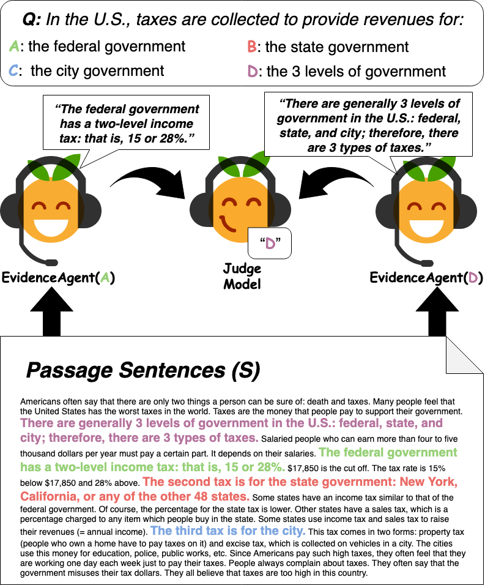

# Finding Generalizable Evidence by Learning to Convince Q&amp;A Models

## Ethan Perez, Siddharth Karamcheti, Rob Fergus, Jason Weston, Douwe Kiela, Kyunghyun Cho

<p align="center"></p>

This repo contains code for training agents to find evidence in a passage for various answers to a question (described in our [EMNLP paper](https://arxiv.org/abs/1909.05863)).
- `convince/allennlp/`: Code and instructions for training our models/agents.
- `convince/ParlAI/`: Code and instructions for running human evaluation on agent-selected evidence.

## Citation

If you find our code or paper useful, consider citing us:

```
@inproceedings{perez-etal-2019-finding,
    title = "Finding Generalizable Evidence by Learning to Convince Q\&A Models",
    author = "Perez, Ethan and Karamcheti, Siddharth and Fergus, Rob and Weston, Jason and Kiela, Douwe and Cho, Kyunghyun",
    booktitle = "Proceedings of the 2019 Conference on Empirical Methods in Natural Language Processing",
    month = nov,
    year = "2019",
    address = "Hong Kong, China",
    publisher = "Association for Computational Linguistics",
    url = "https://arxiv.org/abs/1909.05863"
}
```
